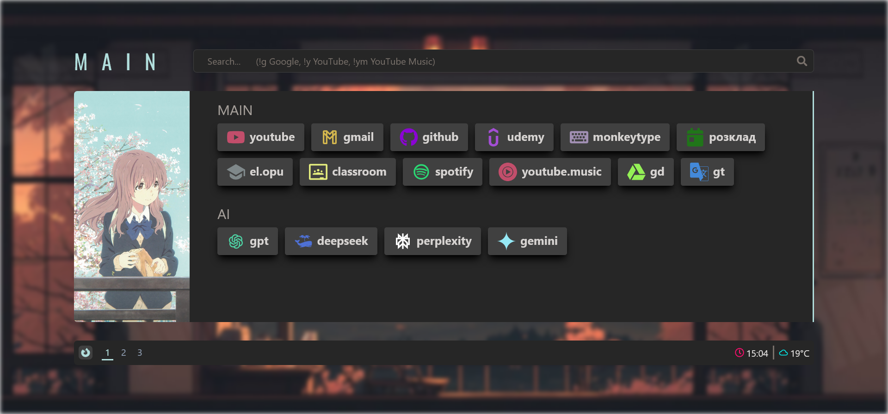

# Samuray New Tab Extension

A custom aesthetic new tab page extension for Firefox.

## Requirements

- Node.js 20.19.0 or higher
- npm 10.2.3 or higher

## Installation

1. Clone the repository
2. Run `npm install`
3. Run `npm run build`
4. The built extension will be in the `dist` folder
5. Create zip-file from inner content of `dist` folder and change its extension from `zip` to `xpi`

## Development

- `npm run dev:watch` - start build with watch mode for automatic rebuilding on changes
- `npm run dev:firefox` - run extension in Firefox with automatic reloading
- `npm run build` - build for production

## Tech Stack

- React 18
- TypeScript
- Tailwind CSS
- Vite
